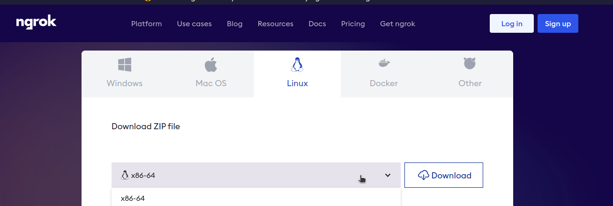

# Build Skeleton Website to Learn Analytics

Used "JS NODE Git Teacher Guru GPT" for code  

# Before You Start

## HTTP vs HTTPS
HTTP is the protocol that creates the hyperlinks you click to access websites.  
HTTPS is the secure version of HTTP. It encrypts the data sent between your browser and the website.  
HTTPS is critical for security and nearly all websites use it.  
For this project, we will use HTTP due to the complexity of setting up HTTPS, since configuring HTTPS is not something you will likely need to understand.  
Further reading: https://www.cloudflare.com/learning/ssl/what-is-https  

## Ports
Ports are used to identify different services running on the same machine.  
HTTP uses port 80 and HTTPS uses port 443. These are default ports set by the IANA.  
Technically you can use any port you want, but that will just make your life difficult. :)  
When running a local server on your own system, the URL is either `localhost` or `127.0.0.1`, accessible by any web browser installed on your system.  
Example: `http://localhost:8080`. Note that the URL is HTTP, not HTTPS.  
For this project, we will use HTTP port 3000: `http://localhost:3000`.

## Adventure Time!
### Install NodeJS with nvm
https://www.digitalocean.com/community/tutorials/how-to-install-node-js-on-ubuntu-22-04

### git-clone this "nodejs-intro-class" repo  
### Create a new git branch named "dev" to separate your work:  
`git checkout -b <your-new-branch-name>`  
To push to your new branch:  
`git push  --set-upstream origin <your-new-branch-name>`  
Now your work will be saved to this separate branch.  

## Server Setup
### Install various NodeJS NPM packages
NPM is one of the main package managers for NodeJS.
This is the same concept as pip for Python or apt for Ubuntu.  

`npm install express`  
`npm install dotenv`  

### Start Local Server

Within the cloned repo project directory the "server.js" file is located in, run:  
`node server.js`  
Open a browser and navigate to http://localhost:3000 to see the website.
You must be in the same directory as the `server.js` file to run the server.  

## Expose localhost server to the Internet 

### Install Ngrok
Ngrok is a tool that allows you to expose a local server to the internet.  
https://ngrok.com/download  

### Download Ngrok (Linux) and install in project folder
Always download the x86_64 version for Linux. This refers to your CPU architecture.  
  
Move the .tgz file to your project directory  
Unzip the .tgz: `tar xvzf ~/Downloads/ngrok-v3-stable-linux-amd64.tgz -C /usr/local/bin`  
This command extracts the file to the /usr/local/bin directory.  
Delete the .tgz file: `rm ~/Downloads/ngrok-v3-stable-linux-amd64.tgz` (_If you don't delete it, you may run into file size issues when pushing to GitHub._)

### Get a unique token to receive a config file:  
Register for a free account  
Your token is located here: https://dashboard.ngrok.com/get-started/setup  
_Note: The token is unique to you and should not be shared with others._
Run `ngrok config add-authtoken <your-token>`  
This saves the token to your config file. Find the location by running `ngrok config check`, but only if you're curious.  
_Yay for config files! If something is broken, there's a good chance the config file has something to with it - and there's also a good chance it's a simple syntax error._

## Set up free ngrok domain
You need to set up a domain for analytics to work.  
Visit https://dashboard.ngrok.com/cloud-edge/domains  
Generate free sample domain and copy the name  

## Expose localhost server to the Internet
Run the code below to expose the server using your generated domain name on port 3000:  
`ngrok http --domain <generated-domain> 3000`  (_The syntax might get you here - there's a space between --domain and the domain name_)  
Now you can visit the generated domain...from anywhere!  

## Analytics connection (_**hold on this - still working on it**_)
Open Google Analytics account here: https://analytics.google.com  
Create a new website property.  
Copy the tracking code GA will provide.  
Place it in the index.html file where requested.  
This is awful security practice, but let's just get this party started and discuss .env later.  

## License
Information about the project's license.  
CC License

# Resources
More NodeJS tutorials: https://www.guru99.com/node-js-tutorial.html  
Might use this project in further stages https://github.com/segmentio/analytics-node